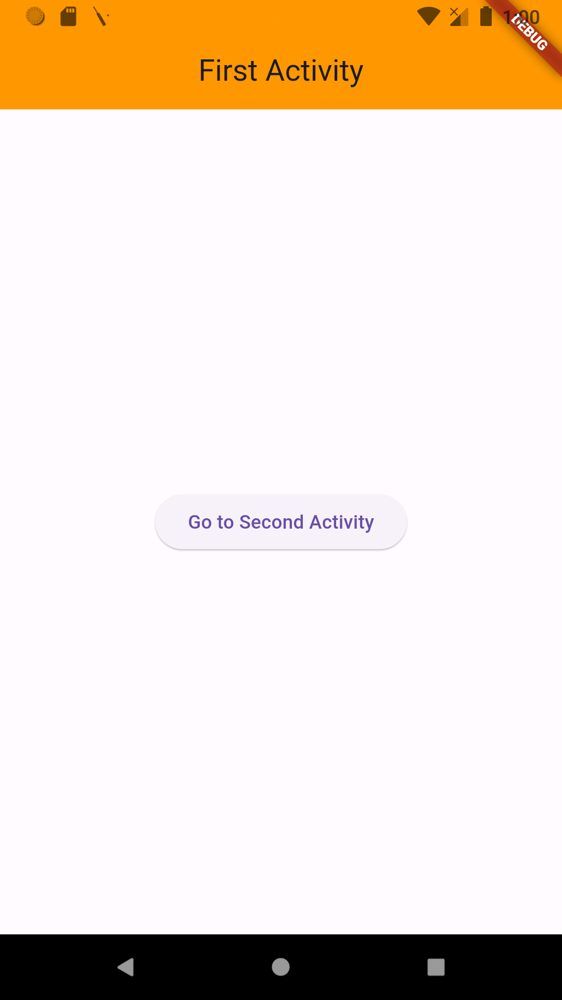
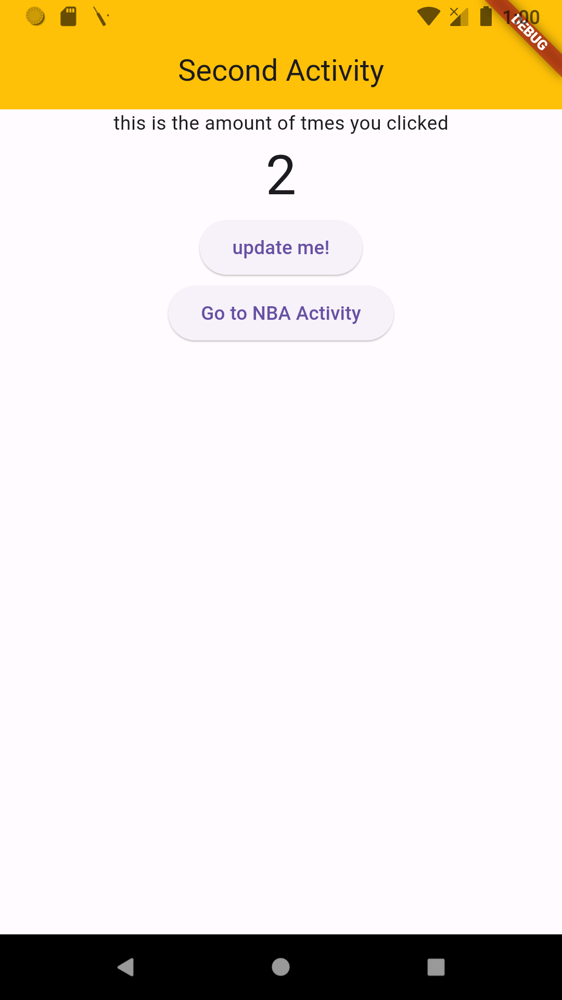

# flutter_test_app

A new Flutter project which I built to learn a few basic concepts in Flutter & dart. The app consists of two screens. We move from first screen to second screen where we can press on a button to update the count of the textbox. 

## Screenshots - 
 

## This project helped me in understadning the following concepts of - 

Flutter Learning Notes - 

**1. Scaffold -** a skelton which holds different parts of your app
 Body : Center 
-> child : Container (a single box) - padding : EdgeInsets, decoration (Color & BorderRadius)
-> child : Text (one more text widget)
-> child : Icon (change colors, a type of favicons)

**2. App Bar -** the main app bar of the app 
-> right side : leading
-> left side : actions[] 

**3. Column -** to add widgets in column one by one vertically
-> Container Widget (height, width, text) : mainAxisAlignment & crossAxisAlignment	
-> Expanded Widget (inside this we need to specify the Container Widget for it to take the height & width according to the content inside it) : flex

**4. ListView** is just like a column but with a scroll. (Android's recyclerview)
-> ListView.builder(itemCount , itemBuilder) (to list items from a defined list)

**5. GridView** (imagine like a chessboard) 
-> GridView.builder (itemCount , gridDelegate (how much items in one row), itemBuilder)

**6. Stack** (one on top of the other, getting stacked) 

**7. GestureDetector :** onTap (to detect user’s gesture and instantiate that function)

**8. Navigator.push** and Navigator.pushNamed 
-> routes 

**9. Drawer** (ontop of AppBar)

**10. BottomNavBar** 
-> BottomNavigationBarItem 

**Stateless vs Stateful widget** 

Stateful - Are widgets that don't change ever 

Changes depending on the state …(if a value changes then you need to rebuild that widget hence stateful widget)
